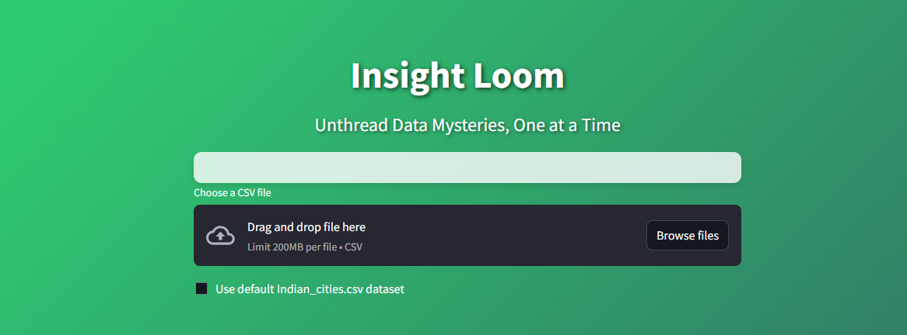

Insight-Loom: Unthread Data Mysteries, One at a Time

Insight-Loom is a Streamlit-based application designed to simplify exploratory data analysis (EDA) and automate data analysis tasks. With a user-friendly interface and powerful features, Insight-Loom allows data analysts and enthusiasts to quickly derive insights from their datasets. The tool leverages OpenAI to enhance data analysis, making it easier to generate code and reports.

Features
1. Data Exploration
📝 Dataset Preview: Quickly display a specified number of rows from your dataset.
📊 Dataset Overview: View key statistics such as the number of rows, columns, and duplicates.
🕳️ Missing Values: Identify and summarize missing values in each column.
📈 Data Statistics and Visualization:
📉 Summary statistics for numerical columns.
📊 Statistics and value counts for categorical columns.
🗂️ Data Types: Explore the data types of each column and filter by data type.
📊 Individual Feature Distribution: Analyze numerical feature distributions using histograms, box plots, or KDE plots.
🔍 Scatter Plot: Visualize relationships between two numerical features.
📊 Categorical Variable Analysis: Analyze categorical variables using bar charts or pie charts.
🔬 Feature Exploration: Examine relationships between multiple numerical features using scatter plot matrices, pair plots, and correlation heatmaps.
📉 Categorical and Numerical Variable Analysis: Analyze the relationship between categorical and numerical variables using box plots.
2. Data Preprocessing
🗑️ Remove Unwanted Columns: Easily remove unnecessary columns from your dataset.
🔧 Handle Missing Data: Choose from various methods to handle missing data, such as removing rows or filling with mean, median, or mode.
🏷️ Encode Categorical Data: Apply one-hot encoding or label encoding to categorical columns.
📏 Feature Scaling: Scale numerical features using standardization or normalization techniques.
🧹 Identify and Handle Outliers: Detect outliers in numerical columns and choose to remove or replace them with the median value.
💾 Download Preprocessed Data: Download the preprocessed dataset as a CSV file.
3. Auto Analysis (BETA)
📊 CSV Analysis: Receive recommendations and analyses based on your CSV file, including suggested visualizations, statistical tests, and insights.
🤖 Perform Auto Analysis: Generate auto analysis code and summaries using OpenAI's language model.
📝 Automatically generate analysis code that includes necessary imports, plots, and explanations.
📑 Receive a detailed summary and analysis, explaining the generated graphs and providing insights as a full story analysis.
📄 Download the auto analysis code and summary as PDF reports.
Usage
Clone the repository:

sh
Copy code
git clone [https://github.com/hritvik16000/master/Insight-Loom.git]
Set your OpenAI API key in the auto_analysis.py file:

python
Copy code
openai.api_key = "YOUR_API_KEY"
Run the Streamlit app:

sh
Copy code
streamlit run main.py
Access the app in your web browser at http://localhost:8502.

Upload your CSV file or use the default "Indian_cities.csv" dataset.

Explore the various features of the app, including data exploration, data preprocessing, and auto analysis.

Dependencies
Streamlit
Pandas
Matplotlib
Seaborn
Scikit-learn
OpenAI
FPDF
Contributing
Contributions are welcome! If you have any ideas, suggestions, or bug reports, please open an issue or submit a pull request.

License
This project is licensed under the MIT License.

Contact
For any questions or inquiries, please contact:

Hritvik Dadhich
Feel free to customize this README file based on your specific project details and add any additional sections or information as needed.
